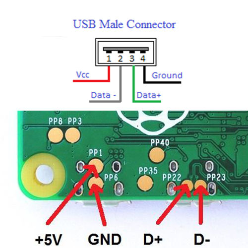
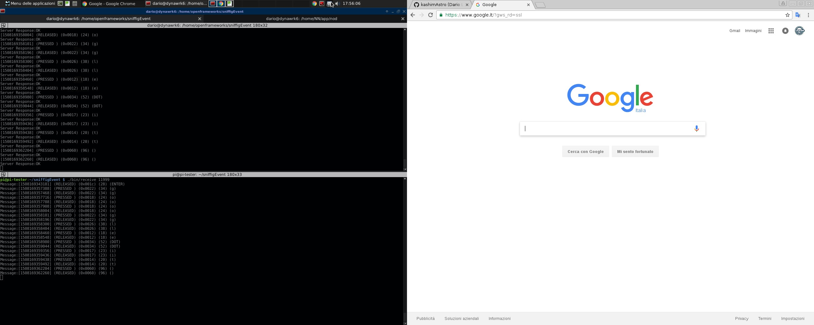

# KDSniffer

a simple sniffer for event keyboard and screen desktop x11,
this demon it is divided into two pieces:

<code><b>bin/sniffer</b></code> 
<b><small>(to be placed on the machine to sniff)</small></b>
  
and 
 
<code><b>bin/receive</b></code> 
<b><small>(this piece is not mandatory, it can need if you want to capture remote sniffer,
via a vpn or as shown in the example below with a raspberry via USB otg.)</small></b> 

a example use with raspberry pi zero otg usb and client pc: 

connect your pi-zero via USB to PC you want to monitor. 

<code><b>PC(sniffer) <---> ZERO(receive)</b></code> 

run the receive on the pi-zero and run sniffer on PC, sniffer it takes care of sending all the keyboard info to the receive. 

usb otg pi-zero: 
 

configure otg usb network on pi-zero:
 
<code><b>edit /boot/config.txt</b></code> 
and add:
<code><b>dtoverlay=dwc2</b></code> 
<code><b>edit /boot/cmdline.txt</b></code> 
and add:
<code><b>modules-load=dwc2,g_ether</b></code> 

assign static ip on pi-zero:
<pre><code><b>allow-hotplug usb0 
iface usb0 inet static 
        address 192.168.7.2 
        netmask 255.255.255.0 
        network 192.168.7.0 
        broadcast 192.168.7.255 
        gateway 192.168.7.1 
</b></code></pre>
screen sniffig: 
 
 

if client side <code>ifconfig does</code> not return USB device, try with:<b> 
<b>ip address show</b> 
<b>ip link set usb0 up</b> 
<b>ifconfig usb0 192.168.7.10</b> 
